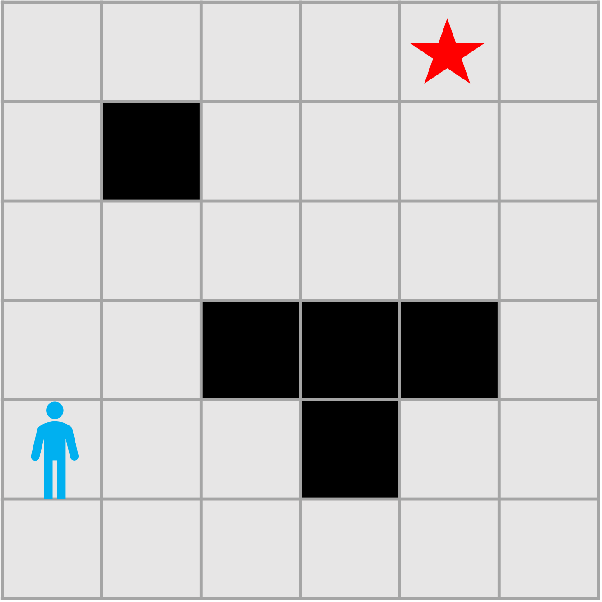
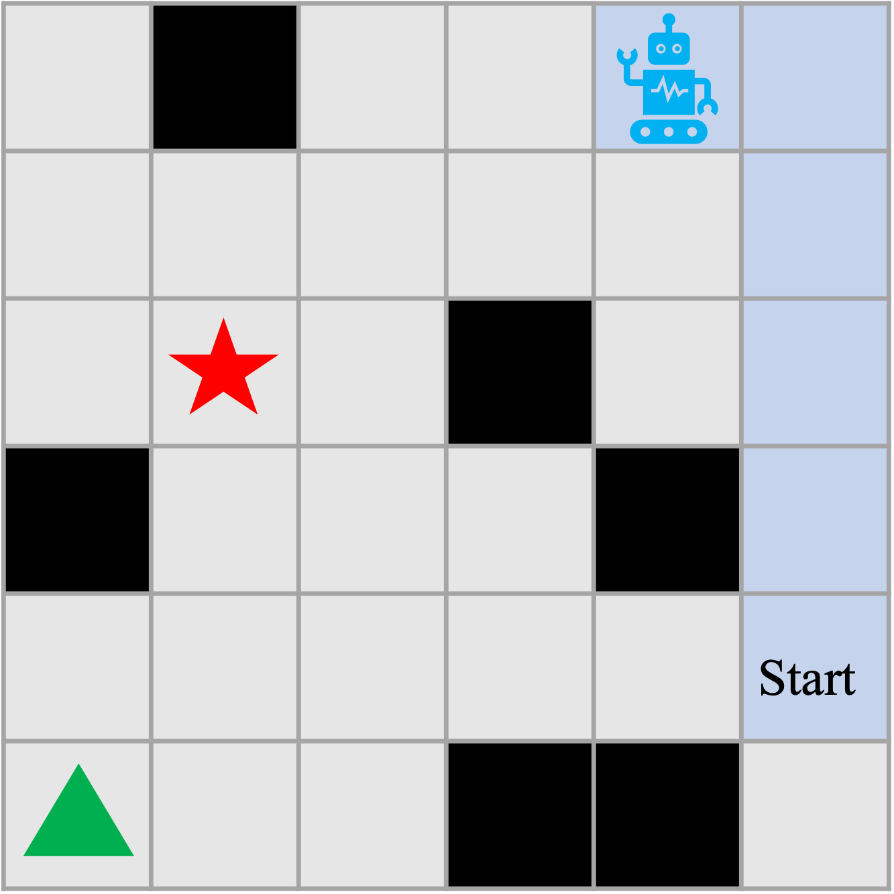

# Navigation Dataset

This dataset captures the behavior of human navigation within a $6 \times 6$ grid world, and how humans infer the goals of other players.

## Navigation Bahavior

The game interface is shown below. Human participants use the keyboard to move the player {up, down, right, left} from a starting position to a designated goal position (marked by a red star). The experiment data is available in [Experiment 1](experiment1/).

<!--  -->

## Belief Inference

The game layout is illustrated below. Human participants observe a robot's movements and are asked to infer which goal (green triangle or red star) the robot is heading towards. The experiment data can be found in [Experiment 2](experiment2/) and [3](experiment3/).

## Notebooks

Detailed data and game layouts are provided in [Notebooks/human_exp.ipynb](Notebooks/human_exp.ipynb).