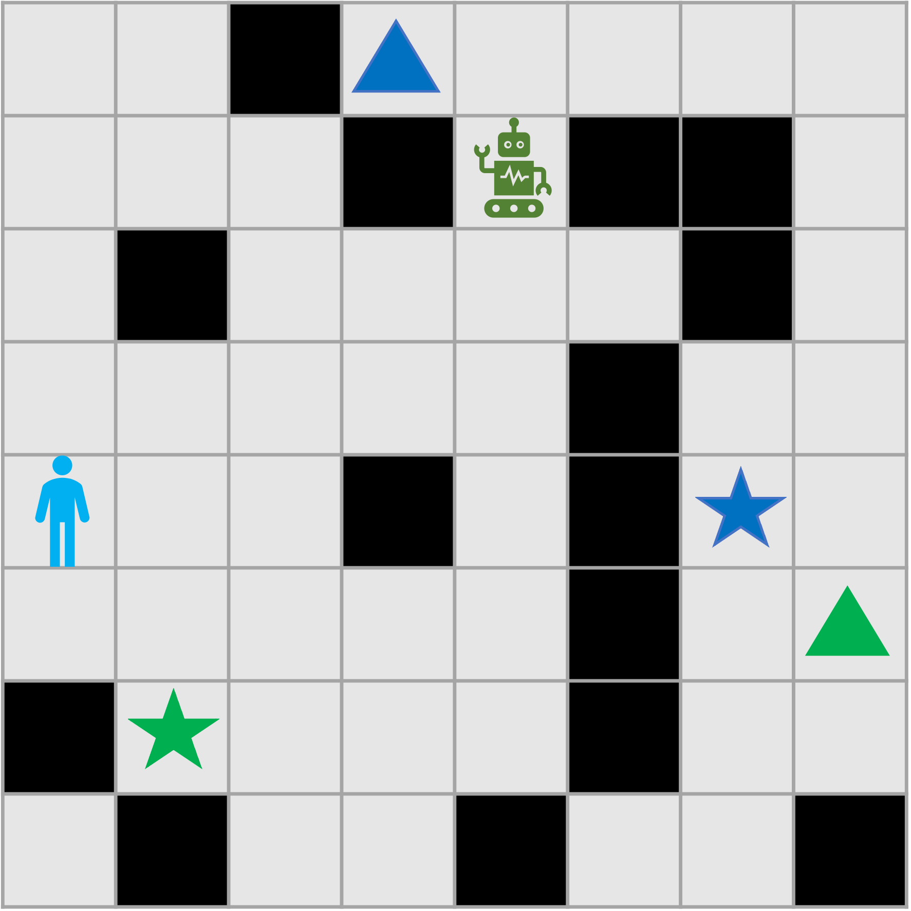
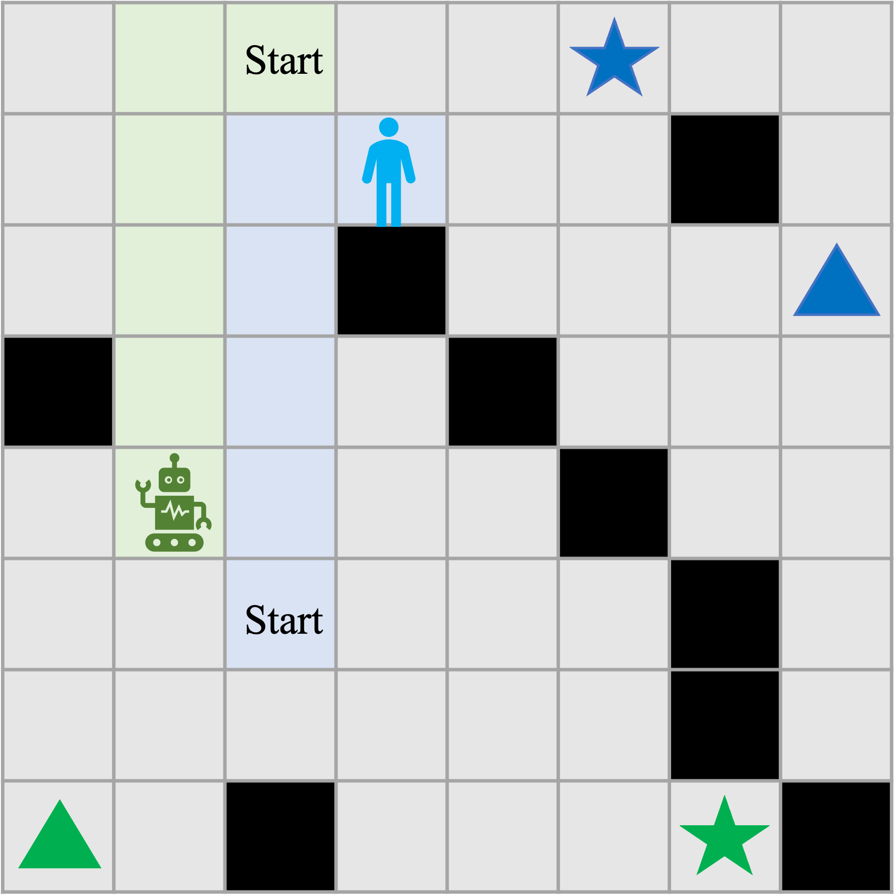

# Navigation Dataset

The dataset used in [our paper](https://arxiv.org/abs/2406.06051) captures human navigation behavior within two grid world environments and examines how humans infer the goals of other players.

## Grid Wrold of Size 6*6

We recruited a total of 800 participants to play navigation and belief inference games in a 6x6 grid world.

- **Navigation Game**: Human participants used the keyboard to move a player {up, down, right, left} from a starting position to a designated goal position (marked by a red star). The experimental data is available in [Experiment 1](experiment1/).
- **Belief Inference Game**: Human participants observed a robot's movements and inferred which goal (green triangle or red star) the robot was heading towards. The experimental data is available in [Experiment 2](experiment2/).

|  |  |
|:--:|:--:|
| *Experiment 1: Navigation Game Interface* | *Experiment 2: Belief Inference Game Interface* |

## Grid Wrold of Size 8*8

We recruited a total of 600 participants to play navigation and belief inference games in an 8x8 grid world.

- **Navigation Game**: Human participants played navigation games alongside a pre-defined AI model. Participants used the keyboard to control player 0 (the blue player) {up, down, right, left, stay} from a starting position to one of the goal positions (marked by a blue star or blue triangle). The AI model controlled player 1 (the green player) to move to one of the goal positions (marked by a green star or green triangle). Participants received a positive reward of +10 if both players reached the same type of goal (either both stars or both triangles). No reward was given if the players collided (moved to the same position) or reached different types of goals. The experimental data is available in [Experiment 3](experiment3/).
- **Belief Inference Game**: Human participants observed the movements of two players and inferred which goal one of the players was heading towards. The experimental data is available in [Experiment 4](experiment4/).

|  |  |
|:--:|:--:|
| *Experiment 3: Two Player Navigation Game Interface* | *Experiment 4: Two Player Belief Inference Game Interface* |

## Notebooks

Detailed data and game layouts are provided in [Notebooks/human_exp.ipynb](Notebooks/human_exp.ipynb).

## Citations

If you use this dataset for research purposes, please cite our paper:

Guanghui Yu, Robert Kasumba, Chien-Ju Ho, and William Yeoh. [On the Utility of Accounting for Human Beliefs about AI Behavior in Human-AI Collaboration](https://arxiv.org/abs/2406.06051). 2024.

## Futher Issues and Questions

If you have issues or questions, you can contact [Guanghui Yu](https://augustusyu.github.io/guanghuiyu.github.io/) at [guanghuiyu@wustl.edu](guanghuiyu@wustl.edu).
